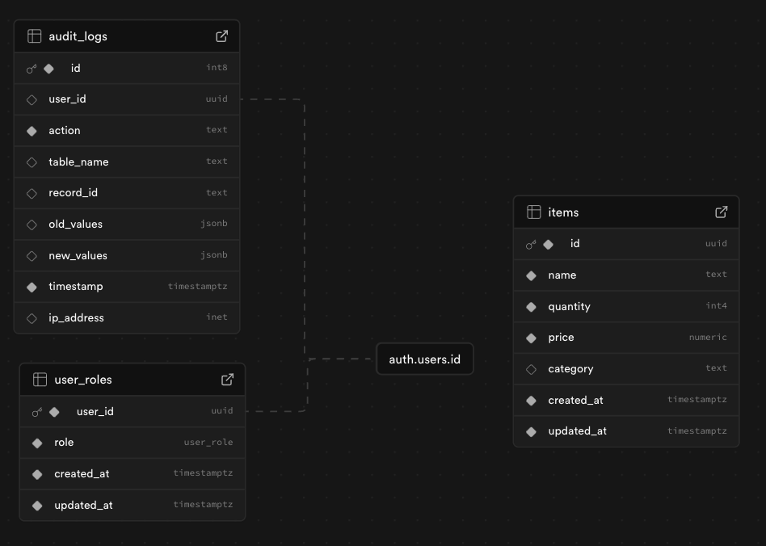

# Inventory Management System

[](https://github.com/gsahlieh/inventory-management-system)

A full-stack inventory management system featuring role-based access control (RBAC), built with Next.js (React/TypeScript/Tailwind CSS) for the frontend, Python Flask for the backend, and Supabase (PostgreSQL) for the database and authentication.

---

## ✨ Live Demo

You can access and try out the live application here:

**➡️ [https://inventory-management-system-frontend-5c1h.onrender.com/](https://inventory-management-system-frontend-5c1h.onrender.com/) ⬅️**

Use the sample admin credentials provided to explore all features.

---

## Technology Stack

- **Frontend:** Next.js, React, TypeScript, Tailwind CSS, Chart.js
- **Backend:** Python, Flask
- **Database:** PostgreSQL (Supabase)
- **Authentication:** Supabase Auth
- **Deployment:** Render (Separate Web Services for Frontend/Backend)
- **Containerization:** Docker, Docker Compose

---

## Database Schema

The application utilizes a Supabase PostgreSQL database with the following key tables:

- `user_roles`: Stores user role assignments.
  - `user_id` (UUID, Foreign Key to `auth.users.id`): Links to the Supabase authenticated user.
  - `role` (Enum: 'admin', 'manager', 'viewer'): The assigned role.
  - `created_at`, `updated_at`: Timestamps.
- `items`: Stores inventory item details.
  - `id` (UUID, Primary Key)
  - `name` (Text)
  - `quantity` (Integer)
  - `price` (Numeric)
  - `category` (Text)
  - `created_at`, `updated_at`: Timestamps.
- `audit_logs`: Records actions performed within the system.
  - `id` (UUID, Primary Key)
  - `user_id` (UUID, Foreign Key to `auth.users.id`): The user performing the action.
  - `action` (Text): Description of the action (e.g., 'ITEM_CREATED', 'QUANTITY_UPDATED').
  - `table_name` (Text): The table affected (e.g., 'items', 'user_roles').
  - `record_id` (UUID): The ID of the record affected.
  - `old_values` (JSONB, nullable): Previous state of the record (if applicable).
  - `created_at`: Timestamp.



---

## Features

- **Role-Based Access Control (RBAC):** Different users (Admin, Manager, Viewer) have specific permissions.
- **Authentication:** Secure user sign-up (with email verification) and sign-in powered by Supabase Auth.
- **Inventory Management:** Add, view, edit, and delete inventory items (permissions vary by role).
- **Quantity Updates:** Managers can update item quantities individually or via bulk CSV upload.
- **Audit Logging:** Tracks user actions (creations, updates, deletions) across key tables.
- **Low-Stock Alerts:** Managers can view items with quantities below a certain threshold (e.g., < 10).
- **Inventory Trends:** Visualize item quantity changes over time using Chart.js (accessible to all roles).
- **Monthly Reports:** Admins can view and generate downloadable PDF inventory reports.
- **User Management:** Admins can view all users and assign/change their roles.

### Role Permissions

- **Admin:**
  - Manage Items: Full CRUD operations (Create, Read, Update, Delete).
  - Manage Users: View users, assign/change user roles (Admin, Manager, Viewer).
  - View Audit Logs: See a complete history of system actions.
  - View & Generate Reports: Access monthly inventory reports and download PDFs.
  - View Item Trends: Visualize quantity history for items.
- **Manager:**
  - Manage Inventory: Update item quantities (single or bulk CSV upload).
  - View Low Stock Alerts: Identify items needing replenishment.
  - View Items: Browse inventory and view details.
  - View Item Trends: Visualize quantity history for items.
- **Viewer:**
  - Browse Inventory: View items, search by name/category, and see full details.
  - View Item Trends: Visualize quantity history for items.

---

## Backend API Routes (Flask)

The Python Flask backend provides the following API endpoints. Routes under `/api/` require authentication via a Supabase-validated JWT (sent as a Bearer token in the Authorization header) and authorization based on specific user roles, both enforced by decorators. Implementation of routes is done in `/backend/app.py`

| Method   | Path                              | Required Role(s)             | Description                                            |
| :------- | :-------------------------------- | :--------------------------- | :----------------------------------------------------- |
| `POST`   | `/api/items`                      | `admin`                      | Add a new inventory item.                              |
| `GET`    | `/api/items`                      | `admin`, `manager`, `viewer` | List all inventory items.                              |
| `GET`    | `/api/items/<item_id>`            | `admin`, `manager`, `viewer` | Get details of a specific item.                        |
| `PUT`    | `/api/items/<item_id>`            | `admin`, `manager`           | Update all details of a specific item.                 |
| `PATCH`  | `/api/items/<item_id>/quantity`   | `admin`, `manager`           | Update only the quantity of a specific item.           |
| `DELETE` | `/api/items/<item_id>`            | `admin`                      | Delete an inventory item.                              |
| `POST`   | `/api/items/bulk-update-quantity` | `manager`                    | Bulk update item quantities via CSV upload.            |
| `GET`    | `/api/users`                      | `admin`                      | List all users and their assigned roles.               |
| `GET`    | `/api/users/<user_id>/role`       | `admin`, `manager`, `viewer` | Get the role of a specific user.                       |
| `PUT`    | `/api/users/<user_id>/role`       | `admin`                      | Assign or update the role for a specific user.         |
| `GET`    | `/api/alerts/low-stock`           | `admin`, `manager`           | Get items with quantity below the low stock threshold. |
| `GET`    | `/api/reports/inventory/monthly`  | `admin`                      | Generate a monthly inventory report (current state).   |
| `GET`    | `/api/audit-logs`                 | `admin`                      | View audit log entries (supports filtering/paging).    |
| `GET`    | `/api/items/<item_id>/trends`     | `admin`, `manager`, `viewer` | Get historical quantity data for a specific item.      |
| `GET`    | `/`                               | _None_                       | Base route to confirm the backend is running.          |

_Note: `<item_id>` and `<user_id>` should be replaced with the actual UUIDs._

---

## Getting Started / Running Locally

### Prerequisites

- Git
- Docker & Docker Compose

### Setup

1.  **Clone the repository:**

    ```bash
    git clone https://github.com/gsahlieh/inventory-management-system.git
    cd inventory-management-system
    ```

2.  **Configure Environment Variables:**

    - Create a `.env` file in the root directory by copying `.env.example`.
    - Fill in the required Supabase URL and Anon Key from your Supabase project settings.

    ```bash
    cp .env.example .env
    # Now edit .env with your Supabase credentials
    ```

3.  **Build and Run with Docker Compose:**

    ```bash
    # Build the Docker images
    docker compose build

    # Start the services in detached mode
    docker compose up -d
    ```

4.  **Access the Application:**

    - Frontend: `http://localhost:3000`
    - Backend API: `http://localhost:5000`

5.  **Stopping the Application:**
    ```bash
    docker compose down
    ```

---

## Sample Credentials (for Live Demo)

You can log in to the live demo using the following admin credentials:

- **Email:** `gsahlieh@gmail.com`
- **Password:** `Sample123!`

_Please use these credentials responsibly for testing purposes only._

---

## Deployment

- The frontend and backend are deployed as separate Web Services on [Render](https://render.com/).
- Deployment is managed via the `docker-compose.yml` file.
- **Frontend URL:** [https://inventory-management-system-frontend-5c1h.onrender.com/](https://inventory-management-system-frontend-5c1h.onrender.com/)
- **Backend URL:** [https://inventory-management-system-hwsh.onrender.com/](https://inventory-management-system-hwsh.onrender.com/)
